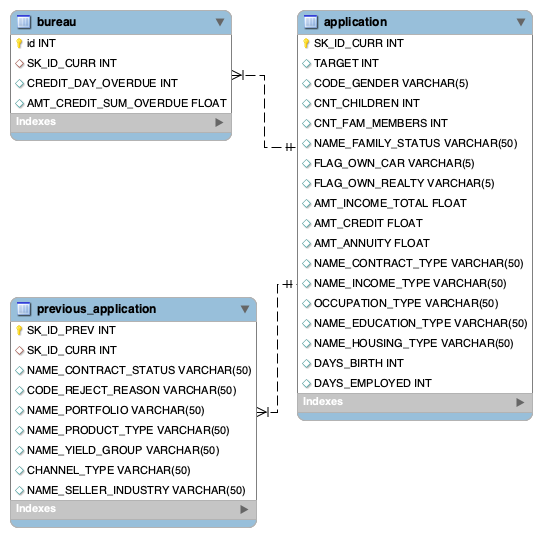
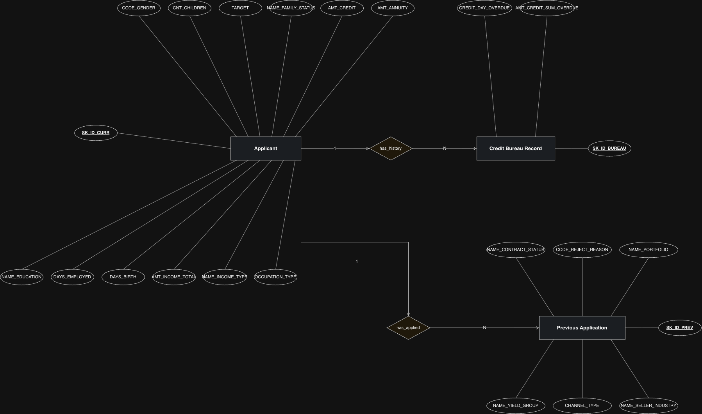

# Project overview

**Credit Crunchers** is a data analytics consultancy specialized in banking
and consumer credit risk. This project simulates us being brought in by a
consumer credit lender that serves clients with little or no formal banking
history. They need to better understand default risk to decide who to lend
to, on what terms, and which products to grow or restrict.

Using the [Home Credit Default Risk](https://www.kaggle.com/competitions/home-credit-default-risk)
dataset, we designed a relational database, cleaned and modeled the data,
and answered five business questions with SQL and Python to support that
decision-making.

**Team**: Aroa, Carla, Paul

# Installation

1. **Clone the repository**:

```bash
git clone https://github.com/YourUsername/repository_name.git
```

2. **Install UV**

If you're a MacOS/Linux user type:

```bash
curl -LsSf https://astral.sh/uv/install.sh | sh
```

If you're a Windows user open an Anaconda Powershell Prompt and type :

```bash
powershell -ExecutionPolicy ByPass -c "irm https://astral.sh/uv/install.ps1 | iex"
```

3. **Create an environment**

```bash
uv venv 
```

3. **Activate the environment**

If you're a MacOS/Linux user type (if you're using a bash shell):

```bash
source .venv/bin/activate
```

If you're a MacOS/Linux user type (if you're using a csh/tcsh shell):

```bash
source .venv/bin/activate.csh
```

If you're a Windows user in Command Prompt:

```bash
.venv\Scripts\activate
```

If you're a Windows user in PowerShell (e.g. Anaconda Powershell Prompt):

```powershell
.\.venv\Scripts\Activate.ps1
```

If that fails with a message about script execution being disabled, run this
once first:

```powershell
Set-ExecutionPolicy -Scope Process -ExecutionPolicy Bypass
```

4. **Install dependencies**:

```bash
uv sync
```

=======
5. **Create the database**

You need MySQL installed and running locally. Then run the schema script,
which creates the `home_credit` database and its three tables
(`application`, `bureau`, `previous_application`) with the columns and
foreign keys described in [Dataset](#dataset) below:

```bash
mysql -u root -p < sql_scripts/create_database.sql
```

(`-u root` matches the `database.user` in `config.yaml` — change it if your
local MySQL user is different. It'll prompt for your MySQL password.)

8. **Populate the tables**

Run these three notebooks, **in this order** — `bureau` and
`previous_application` both have a foreign key to `application.SK_ID_CURR`,
so if you run them before `application` is loaded, they'll filter out every
row and load nothing:

1. `notebooks/explore_clean_data_aroa.ipynb` (`application`)
2. `notebooks/explore_clean_data_paul.ipynb` (`bureau`)
3. `notebooks/explore_clean_data_carla.ipynb` (`previous_application`)

Each one reads its raw CSV, cleans it, and loads it into MySQL — no extra
setup needed beyond steps 1–7 above.

**Run each notebook only once.** They `INSERT` into tables that already
have their schema, they don't clear anything first, so a second run doesn't
behave the same way twice:

- `application` and `previous_application` have a primary key
  (`SK_ID_CURR`, `SK_ID_PREV`), so running them again throws a
  duplicate-key error. Nothing gets corrupted, but you'll see a big
  MySQL error.
- `bureau` has no natural key, just a surrogate `id` — running it again
  won't error, it'll silently insert every row a second time and double
  the table.

If you need to start clean, delete the tables in this order (children
before parent, since `bureau` and `previous_application` reference
`application` via foreign key):

```bash
mysql -u root -p -e "USE home_credit; DELETE FROM bureau; DELETE FROM previous_application; DELETE FROM application;"
```

# Questions

1. **Which applicant profiles concentrate the risk of default?**
   Which criteria to use when approving, rejecting, or requiring additional
   guarantees.

2. **How does prior credit history relate to default risk?**
   Whether different levels of credit history need different treatment —
   verified as a 3-tier gradient: clean history 7.62% default, no history
   10.12%, troubled history 15.78%.

3. **Is a returning client a better client than a new one?**
   Whether to invest in retention or in acquisition — verified,
   counter-intuitively, new clients default *less* (5.94%) than clients
   with previously approved loans (8.19%).

4. **Were past rejections the right call?**
   Whether current rejection criteria are well calibrated or are turning
   away profitable business.

5. **Which products and channels concentrate the risk?**
   Which products to push, which to restrict, and which sales channels
   need tighter controls.

# Dataset 

Three tables from [Home Credit Default Risk](https://www.kaggle.com/competitions/home-credit-default-risk),
trimmed to the columns the 5 questions above actually need. Schema in
[`sql_scripts/create_database.sql`](sql_scripts/create_database.sql), column
selection reasoning in
[`notebooks/column_selection_combined.ipynb`](notebooks/column_selection_combined.ipynb).

ERD, generated with MySQL Workbench's Database → Reverse Engineer directly from
the live `home_credit` database (not hand-drawn):



Both are one-to-many from `application`, joined on `SK_ID_CURR`: one applicant
can have many prior credits at other institutions (`bureau`) and many prior
applications with Home Credit itself (`previous_application`). `bureau` keeps
no surrogate key of its own — it's trimmed down to just what Q2 needs.

Conceptual model (ERM, Chen notation) of the three tables we're using and how
they relate through `SK_ID_CURR`:



Conceptual model (ERM, Chen notation) of the three tables we're using and how
they relate through `SK_ID_CURR`:


## Main dataset issues

- ...
- ...
- ...

## Solutions for the dataset issues
...

# Conclussions
...

# Next steps
...
